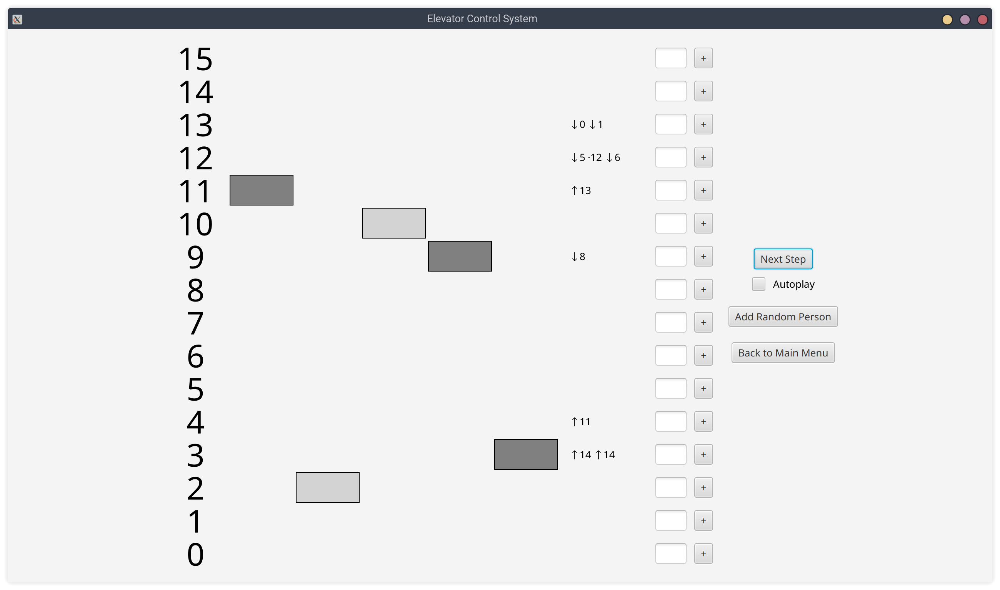

# Elevator Control System
A system controlling the movement of multiple elevators in a building with an arbitrary number of floors.

# How to run
Tested on **Java 17**.

    ./gradlew run
1. Input the number of elevators and floors in the building.
   - Up to ~100 elevators and floors each is recommended for readability.
2. Control the simulation using options on the right side.
   - "Autoplay" checkbox allows you to make a next step in the simulation every 200ms.
   - You can add a new person, waiting for their elevator. The input type depends on building height:
     - For low numbers: enter the destination next to the desired starting floor and click "+".
     - For high numbers: enter both the starting floor and the destination and click "Add New Person".
   - "Add Random Person" allows you to quickly add a new person with completely random values.
3. Observe the system on the left side.
   - Every elevator is marked with a rectangle next to its current floor.
   - Light gray interior indicates open doors, dark gray - closed ones.

# Technical details
- Every step in the simulation allows:
  - People to step into or out of an elevator.
  - Elevators to either open or close its doors, or move up or down a floor (only with closed doors).
- ElevatorSystem tries to assign every waiting person an elevator. Only idle elevators or elevators with correct direction (pointing to person's starting floor) are considered. We choose an elevator closest to this person.
  - Sometimes another person may walk into the assigned elevator and choose different direction. We catch such situations and assign a new one for them.
- The system **does not know** person's exact destination. This information is provided only after "clicking the button" inside of an elevator. It is displayed in the app only for better readability.
- Elevator's destination is the closest floor on the waiting list in its current direction. This means that it only changes direction if no more requests are left (elevator is empty and the system didn't assign anyone else) and it goes idle.
- *src/test/* directory contains few tests checking that every person finally gets to their destination. It can be also used to compare number of steps in the simulation to compare different solutions.